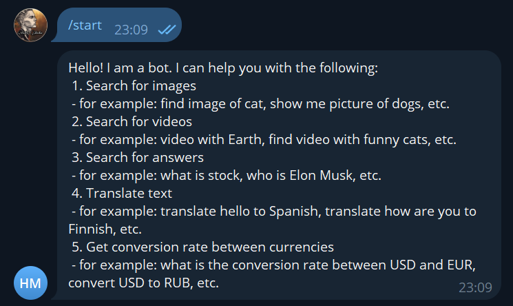
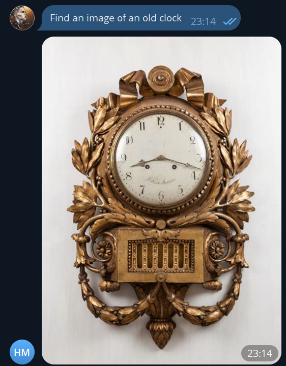
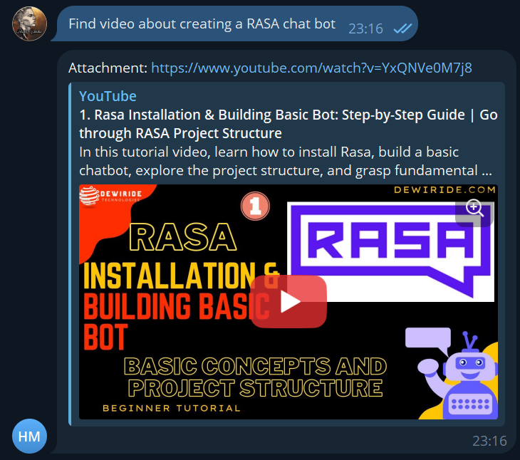
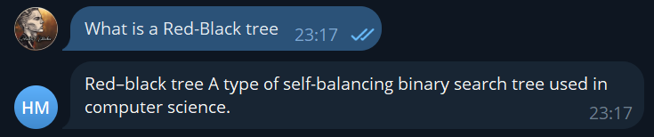
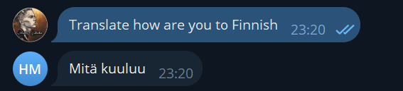
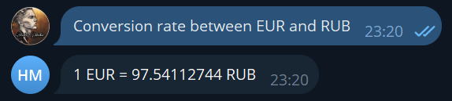

# Development a Conversational Chatbot using RASA

## Introduction

In this report, I detail my journey in developing and deploying a conversational chatbot using the RASA framework in Python, with a focus on integration with the Telegram API. This integration allows the chatbot to be accessible on the Telegram platform, enhancing user engagement and accessibility.

## Design and Implementation

The chatbot is designed with custom actions such as action_conversion_rate, action_search_answer, action_search_image, action_search_video, and action_translate. These actions, written in Python, enable the chatbot to perform diverse functions like fetching data from external sources based on user queries.

The NLU component, managed by RASA's NLU module (nlu.yml), interprets user inputs to determine intents and entities. The conversation flow is directed by stories (stories.yml) and rules (rules.yml), which map out the bot's responses based on user interactions. The domain file (domain.yml) lists the bot's skills, including all possible intents, entities, actions, and user responses. Test stories (test_stories.yml) are utilized for evaluating the chatbot's functionality.

## Integration with Telegram API

To make the chatbot accessible on Telegram, I integrated it with the Telegram API. This involved setting up a webhook for the bot, enabling real-time communication with users on the Telegram platform. The integration process was straightforward, leveraging RASA's capabilities to connect with external messaging platforms.

## Deployment in Production

The chatbot was deployed in a production environment, making it available for real-world use and interaction. I used my own dedicated server for deployment.

## Functionality

* **Greeting:** Greets the user with a welcome message and provides a brief description of the bot's capabilities.
* **Image and Video Search:** Uses [DuckDuckGo's Search API](https://github.com/deedy5/duckduckgo_search) for fetching images and videos based on user queries.
* **Answer Search:** Provides answers to user queries using [DuckDuckGo's Instant Answers API](https://github.com/deedy5/duckduckgo_search).
* **Translation:** Offers translation services for various languages using [DuckDuckGo's translation API](https://github.com/deedy5/duckduckgo_search).
* **Conversion Rate:** Delivers daily updating currency conversion rates using [Free Currency Rates API](https://github.com/fawazahmed0/currency-api).

## Links

* GitHub Repository - [markovav-official/rasa-search-chat-bot](https://github.com/markovav-official/rasa-search-chat-bot)
* Deployed Telegram Bot - [@andrei_markov_haiid_bot](https://t.me/andrei_markov_haiid_bot)

## Examples

* **Greeting:** \

* **Image Search:** \

* **Video Search:** \

* **Answer Search:** \

* **Translation:** \

* **Conversion Rate:** \

## Conclusion

This project demonstrates the practical application of the RASA framework in creating a multifunctional chatbot, integrated with Telegram for wider accessibility. The successful deployment in a production environment highlights the bot's robustness and efficiency.

## References

Bocklisch, T., Faulkner, J., Pawlowski, N., & Nichol, A. (2017). Rasa: Open Source Language Understanding and Dialogue Management. https://doi.org/10.48550/ARXIV.1712.05181

Introduction to Rasa open source & Rasa pro. (n.d.). Rasa.com. Retrieved from https://rasa.com/docs/rasa/

Braun, D., Hernandez-Mendez, A., Matthes, F., & Langen, M. (2017). Evaluating Natural Language Understanding Services for Conversational Question Answering Systems. Proceedings of the 18th Annual SIGdial Meeting on Discourse and Dialogue. https://dx.doi.org/10.18653/v1/W17-5522
